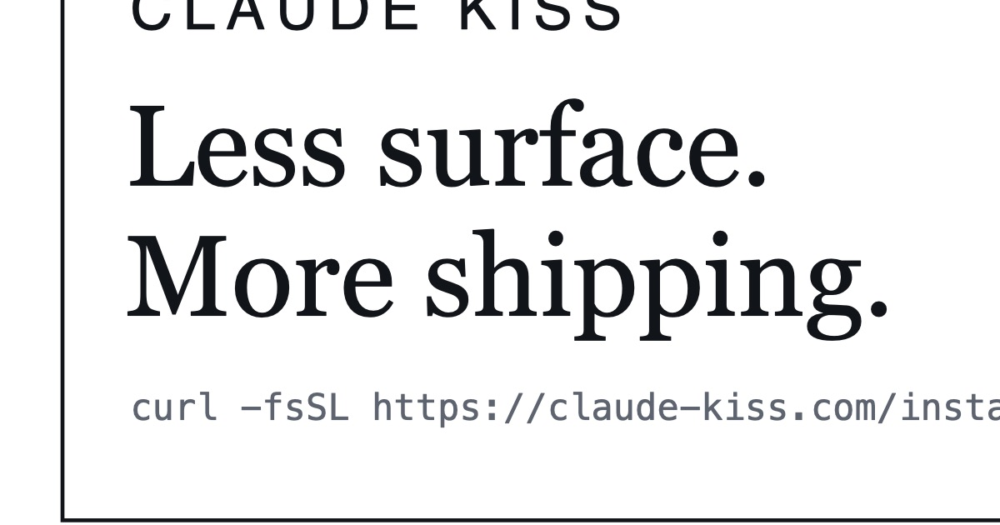

# Claude KISS

<p align="center">
  <strong>Claude Code, tuned for people who ship.</strong>
</p>

<p align="center">
  Less surface. More shipping. A second launcher with concise, user-first defaults:
  keep the useful Claude Code harness, remove the product noise, own every file, and
  inspect the exact command before it runs.
</p>

<p align="center">
  <a href="https://github.com/aphoristicartist/claude-kiss/actions/workflows/ci.yml"></a>
  <a href="https://github.com/aphoristicartist/claude-kiss/releases/latest"></a>
  <a href="https://claude-kiss.com"></a>
  <a href="LICENSE"></a>
  
  
</p>

<p align="center">
  <a href="https://claude-kiss.com">
    
  </a>
</p>

---

## Install

Install [Claude Code](https://claude.com/claude-code) and authenticate with `claude` first.
Then install Claude KISS:

```sh
curl -fsSL https://claude-kiss.com/install.sh | sh
```

Prefer to inspect code before running it? You should:

```sh
curl -fsSL https://claude-kiss.com/install.sh -o claude-kiss-install.sh
less claude-kiss-install.sh
sh claude-kiss-install.sh
```

Check the effective installation:

```sh
claude-kiss doctor
```

Start a KISS session:

```sh
claude-kiss
```

Your ordinary command remains exactly where it was:

```sh
claude
```

Claude KISS does **not** replace `claude`, patch its binary, rewrite `~/.claude`, or change
your existing Claude Code defaults.

## What it does

Claude KISS is a transparent launcher and configuration layer, not a fork or API proxy.
It gives Claude Code:

- a concise builder-first system prompt;
- six core coding tools by default;
- no bundled skills, workflows, connectors, artifacts, or agent view;
- no normal MCP discovery unless explicitly requested;
- no attribution inserted into commits or PRs;
- supported opt-outs for telemetry, error reporting, feedback, auto-update, and related
  nonessential traffic;
- explicit long-session compaction control;
- user-owned files that installer updates never overwrite.

The important distinction is what “concise” means here:

> KISS is the smallest complete robust solution—not minimal effort, a stub, or a special
> case that passes one visible test.

## The 60-second tour

### 1. Try the defaults

```sh
claude-kiss
```

Default tools:

```text
Bash
Glob
Grep
Read
Edit
Write
```

Ask a question and Claude answers rather than turning it into an editing project. Ask for
a fix and Claude inspects the relevant code, repairs the root cause, validates the change,
and stays inside the requested scope.

### 2. See exactly what will run

```sh
CLAUDE_KISS_DRY_RUN=1 claude-kiss
```

The wrapper prints the native Claude Code command, selected prompt, settings, compaction
mode, and memory path. There is no hidden runtime and no second vendor to trust.

### 3. Own the configuration

```sh
claude-kiss init
```

This copies the managed assets to your user configuration directory:

```text
~/.config/claude-kiss/
  prompt.md
  settings.json
  memory/CLAUDE.md
```

The files are yours. Edit them with any editor. Future Claude KISS updates replace managed
defaults, never these files.

### 4. Inspect where every choice came from

```sh
claude-kiss doctor
```

`doctor` reports whether each asset is using:

```text
managed default
user-owned file
environment override
```

It also verifies that the installed Claude Code supports every native flag KISS uses.

## What changes immediately

| Area | Ordinary Claude Code | Claude KISS |
|---|---|---|
| System prompt | Claude Code default | Concise builder-first replacement |
| Built-in tools | Broader default surface | Six core coding tools |
| Bundled skills/workflows | Available by default | Disabled |
| Agent view, artifacts, connectors, remote control | Available through normal surface | Disabled |
| MCP | Normal discovery | Strict mode; no unrelated discovery |
| Project/local settings | Loaded | Skipped by default |
| User settings | Loaded | Loaded, so `/model` still works |
| Repository memory | Normal behavior | Normal project-root behavior retained |
| Auto memory | Vendor default | Disabled |
| Attribution | Claude attribution | Removed |
| Auto-update, telemetry, surveys, error reporting | Vendor defaults | Supported opt-outs enabled |
| Compaction | Normal behavior | Selectable profiles plus KISS handoff policy |
| Existing installation | — | Untouched |

Optional capability remains one argument or environment variable away.

## Configure without a config framework

There is no YAML, plugin system, profile marketplace, or nested abstraction. Use native
Claude flags, environment variables, and plain files you own.

| Goal | Command |
|---|---|
| Restore Claude’s broader built-in tool set | `CLAUDE_KISS_TOOLS=default claude-kiss` |
| Add one tool | `CLAUDE_KISS_TOOLS=Bash,Glob,Grep,Read,Edit,Write,Agent claude-kiss` |
| Disable slash commands | `CLAUDE_KISS_DISABLE_COMMANDS=1 claude-kiss` |
| Use one explicit MCP config | `claude-kiss --mcp-config ./mcp.json` |
| Restore normal MCP discovery | `CLAUDE_KISS_MCP=1 claude-kiss` |
| Disable CLAUDE.md loading | `CLAUDE_KISS_CLAUDE_MD=0 claude-kiss` |
| Use a separate Claude config directory | `CLAUDE_KISS_ISOLATED=1 claude-kiss` |
| Replace the system prompt directly | `claude-kiss --system-prompt-file ./prompt.md` |
| Show the final command | `CLAUDE_KISS_DRY_RUN=1 claude-kiss` |

Direct native Claude arguments win over KISS defaults. The wrapper scans for the relevant
flags and does not add a competing value.

## Own every file

Configuration precedence is deliberately simple:

```text
direct Claude CLI argument
  > CLAUDE_KISS_* environment override
  > user-owned file
  > managed KISS default
```

After `claude-kiss init`, edit:

```sh
$EDITOR ~/.config/claude-kiss/prompt.md
$EDITOR ~/.config/claude-kiss/settings.json
$EDITOR ~/.config/claude-kiss/memory/CLAUDE.md
```

Use a different location:

```sh
CLAUDE_KISS_CONFIG_HOME=~/.config/my-kiss claude-kiss init
CLAUDE_KISS_CONFIG_HOME=~/.config/my-kiss claude-kiss
```

Installer updates do not merge, migrate, overwrite, or “improve” these files.

## Context compaction

Long sessions fail when the model remembers activity but loses the objective. Claude KISS
ships an editable compact-handoff policy and five timing modes.

| Profile | Auto-compact | Compact command | KISS compact memory |
|---|---:|---:|---:|
| `kiss` | enabled | enabled | yes |
| `plain` | enabled | enabled | no |
| `early` | enabled | enabled | yes |
| `manual` | disabled | enabled | yes |
| `off` | disabled | disabled | no |

```sh
# Default tuned profile
claude-kiss

# Compact earlier
CLAUDE_KISS_COMPACT=early CLAUDE_KISS_AUTOCOMPACT=400k claude-kiss

# Keep context until you explicitly compact
CLAUDE_KISS_COMPACT=manual claude-kiss

# Disable compaction completely
CLAUDE_KISS_COMPACT=off claude-kiss
```

## Trust boundary

Claude KISS reduces the default product surface, but it is not a sandbox.

Be explicit about what that means:

- `Bash` remains available and is powerful.
- Tool restrictions are an attention and behavior surface, not filesystem isolation.
- MCP is hidden unless explicitly enabled; it is not made safe by hiding it.
- Review MCP configs, repository instructions, aliases, and Claude permissions as you
  normally would.
- The compact-memory deny rules discourage normal `Read`/`Edit` access; they do not make
  the file immutable.

What Claude KISS does guarantee is transparency:

- one shell wrapper you can read;
- one installer you can inspect;
- native flags shown by dry-run;
- managed defaults separated from your files;
- ordinary Claude Code left unchanged.

## Measured, not magical

The repository includes a paired evaluator rather than a marketing benchmark. It runs
ordinary Claude and Claude KISS against identical isolated fixtures and measures:

- task correctness;
- file scope;
- created files;
- added comments;
- hidden anti-hardcoding behavior;
- visible and hidden test results;
- response size;
- reported tokens, cost, turns, and wall time.

Current task families:

| Flow | Task |
|---|---|
| Answer without editing | `concise_answer` |
| Minimal root-cause fix | `minimal_bugfix` |
| Focused implementation | `scope_discipline` |
| No lazy special case | `no_lazy_workaround` |
| Regression-test discipline | `targeted_regression_test` |
| Cross-file bug fix | `cross_file_bugfix` |
| Review-only response | `review_no_edit` |
| Resume from a handoff | `long_horizon_handoff` |

Run it:

```sh
python3 evals/run_evals.py
```

Model requests can cost real money. Control the run:

```sh
python3 evals/run_evals.py \
  --model YOUR_MODEL \
  --effort high \
  --budget 1.0
```

The checked-in snapshot is a four-task paired smoke run from 2026-08-20. Both launchers
passed 4/4 tasks. KISS averaged 56.6% fewer result words, 49.5% fewer cache-read tokens,
61.0% lower reported cost, and 29.1% less wall time, while using more agent turns. It is
not statistical proof; the evaluator is included so you can reproduce or challenge it.

## Install options

From a checkout:

```sh
./install.sh
```

Defaults:

```text
executable:  ~/.local/bin/claude-kiss
assets:      ~/.local/share/claude-kiss
user config: ~/.config/claude-kiss
```

Custom managed locations:

```sh
./install.sh --prefix ~/.opt --data-dir ~/.opt/share/claude-kiss
~/.opt/bin/claude-kiss
```

The installer:

- requires Claude Code to be installed;
- checks required native CLI capabilities;
- uses `curl` or `wget` for a standalone release install;
- verifies the SHA-256 checksum of the official domain release archive;
- does not use `sudo`;
- stages files beside their destinations for same-filesystem replacement;
- leaves user configuration untouched.

Uninstall managed files:

```sh
./install.sh --uninstall
```

Your `~/.config/claude-kiss` directory remains.

## Requirements

- macOS or Linux
- Claude Code CLI with support for the native flags listed by `claude-kiss doctor`
- `curl` or `wget` only for standalone installation
- Python 3 only for the optional evaluator and repository tests

## Verify locally

```sh
./tests/test.sh
sh -n bin/claude-kiss install.sh tests/test.sh
python3 -m py_compile evals/run_evals.py
python3 -m json.tool config/settings.json
```

The tests cover launcher arguments, user-owned configuration, installer update/uninstall
behavior, settings invariants, compaction modes, and evaluator checks.

## Why no profiles?

Named profiles are convenient until they become another framework. A raw tool list is more
honest and easier to reason about:

```sh
CLAUDE_KISS_TOOLS=Bash,Glob,Grep,Read,Edit,Write,WebFetch,WebSearch claude-kiss
```

If you use that combination often, own it in your shell:

```sh
alias ck-research='CLAUDE_KISS_TOOLS=Bash,Glob,Grep,Read,Edit,Write,WebFetch,WebSearch claude-kiss'
```

Claude KISS does not need to know about your aliases.

## No-BS policy

- Less is more: one HTML page, one stylesheet, and no website JavaScript.
- No wrapper telemetry.
- No auto-update.
- No marketplace.
- No bundled prompt packages.
- No cloud sync.
- No config format invented for this project.
- No claim that a prompt replaces review, testing, or security judgment.
- No silent fallback when a required Claude Code capability is missing.

## Website

The source for [claude-kiss.com](https://claude-kiss.com) is stored in [`website/`](website).
The site follows the same KISS constraint as the launcher: one HTML page, one stylesheet,
system fonts, no JavaScript, no analytics, no external fonts, and no framework. Its
release artifacts are built from this repository, so the domain serves the same code and
assets you can audit here.

## Contributing

Small, complete changes win.

Before submitting:

```sh
./tests/test.sh
```

Keep changes scoped to the stated objective. Do not weaken a failing check, hide behavior
under a test-specific special case, or add a configuration layer when an environment
variable and a plain file already solve the problem.

## License

[MIT](LICENSE) © Aleksandr Lisenko

Claude KISS is an independent project. It is not produced by, endorsed by, or affiliated
with Anthropic.
